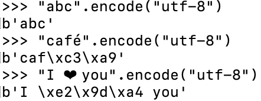

% Programmation avec Python (chapitre 14)
% Dimitri Merejkowsky

\center \huge Parlons de binaire

# Bits et octets

* Un bit (*bit* en anglais) c'est la valeur 1 ou 0
* Un octet (*byte* en anglais) c'est une suite de 8 bits

# À retenir

**Ces paquets de 8 ne veulent rien dire en eux-mêmes**.
Ils n'ont de sens que dans le cadre d'une *convention*.

Détaillons.


# Bases

On peut *interpréter* bits et octets comme des nombres

```
10: 0..9     305 305  3*100 + 0*10 + 5*1
 2: 01         5 101  1*4 + 0*2 + 1*1
16: 0..9..F 3490 DA2  (d=13)*256 + (a=10)*16 + 2*1
```

# Bases en Python

```python
>>> 5
5
>>> 0b101
5
>>> 0xda2
3490
```

```python
>>> bin(5)
"0b101"
>>> hex(3490)
"0xda2"
```

# Poids des bits

```python
0b0010010 # 18
0b0010011 # 19
0b1010010 # 82
```

Le premier bit est plus "fort" que le dernier - little endian

# Manipuler des octets en Python

Avec `bytearray` par exemple:

```python
data = bytearray(
  [0b1100001,
   0b1100010,
   0b1100011
  ]
)
# equivalent:
data = bytearray([97,98,99])
# equivalent aussi:
data = bytearray([0x61, 0x62, 0x63]
```


# Texte

On peut interpréter des octets comme du texte - c'est la table ASCII


# ASCII - remarques

* C'est *vieux* - 1960
* Le A est pour American
* Ça sert à *envoyer* du texte sur des terminaux d'où les "caractères" non-imprimables dans la liste
* Mais c'est une convention *très* utilisée

# Utiliser ASCII en Python

Avec `chr` et `ord`

```python
>>> chr(98)
'b'
>>> ord('a')
97
```

# Affichage des bytearrays en Python

Python utilise ASCII pour afficher les bytearrays si les caractères sont "imprimables"

```python
>>> data = bytearray([97,98,99])
>>> data
bytearray(b"abc")
```

Et `\x` et le code hexa sinon:

```python
>>> data = bytearray([7, 69,  76, 70])
>>> data
bytearray(b"\x07ELF")
```

# Types

La variable `b"abc"` est une "chaîne d'octets", de même que `"abc"` est une "chaîne de caractères".

Python apelle ces types `bytes` et `str`:

```python
>>> type("abc")
str
>>> type(b"abc")
bytes
```
Notez bien que ce qu'affiche Python n'est qu'une *interpétation* d'une séquence d'octets.

# bits versus bytearray

De la même manière qu'on ne peut pas un caractère dans une string, on ne peut
pas modifier un bit - ou un octet dans un `bytes`.

```python
>>> a = "foo"
>>> a[0] = "f"
TypeError: 'str' object does not support item assignment
>>> b = b"foo"
>>> b[0] = 1
TypeError: 'bytes' object does not support item assignment
```

# bits versus bytearray (2)

Par contre on peut modifier un bytearray

```python
>>> b = bytearray(b"foo")
>>> b[0] = 103
>>> b
bytearray("goo")
```

# Conversion octets - texte

Avec `encode()` et `decode()`:

```python
>>> text = "hello"
>>> text.encode("ascii")
b"hello"
>>> octets = b"goodbye"
>>> text = octets.decode("ascii")
"goodbye"
```


# Plus loin que l'ASCII

Pas de caractères accentués dans ASCII. Du coup, on a d'autres *conventions* qu'on appelle "encodage".

```python
# latin-1: utilisé sur certains vieux sites
# souvent européens
>>> bytearray([233]).decode('latin-1')
'é'
```

```python
# cp850: dans l'invite de commande Windows
>>> bytearray([233]).decode('cp850')
'Ú'
```

Mais ça, c'était avant.

# UTF-8

* La table unicode - caractère -> codepoint
* Un encodage qui a mis tout le monde d'accord
* Compatible avec ASCII

# UTF-8 en pratique

* Certains caractères sont représentés par 2 octets ou plus:



*note: toutes les séquences d'octets ne sont pas forcément valides*

# Conséquences

* Peut représenter *tout* type de texte (latin, chinois, coréen, langues disparues, ....)
* On ne peut pas accéder à la n-ème lettre directement dans une chaîne unicode, il faut parcourir lettre par lettre


# Fichiers

```python
with open("fichier.txt", "r") as f:
    contents = f.read()  # type: str
```

\vfill

```python
with open("fichier.txt", "rb") as f:
    contents = f.read() # type: bytes
```

# Conclusions

* On utilise souvent le binaire pour échanger entre Python et le monde extérieur
* Le 'plain text' n'existe pas: tout texte a un *encodage*, et il vous faut connaître cet encodage
* Si vous avez le choix, utilisez UTF-8
